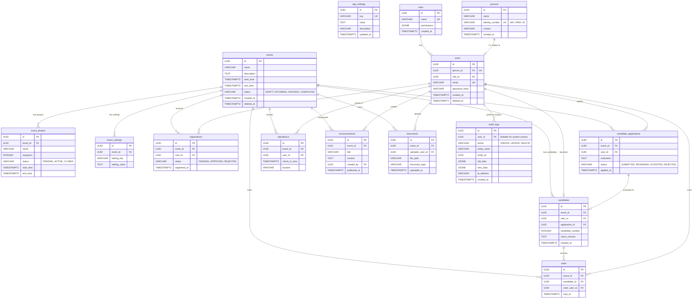

# Entity Relationship Diagram (ERD) MUSKOM

Dokumen ini mendefinisikan hubungan antar-entitas (tabel) pada basis data MUSKOM. Desain ini dirancang khusus untuk memfasilitasi kebutuhan pendaftaran pengguna, fase-fase persidangan atau musyawarah, dan manajemen pencalonan (kandidat) serta pemungutan suara (voting).

## Diagram Mermaid

