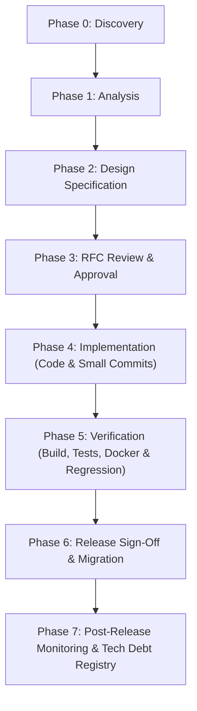

# MUSKOM Software Development Lifecycle (SDLC)

**Version:** RC-1  
**Status:** Mandatory Governance Framework  

## The 8-Phase SDLC Trajectory

## Phase Deliverables Summary
- **Phase 0 (Discovery):** Business domain ownership check, duplication search.
- **Phase 1 (Analysis):** 7-vector analysis (Business, Architecture, UX, DB, API, Deployment, Risk).
- **Phase 2 (Design):** API contract, workflow diagram, DB changes, acceptance criteria.
- **Phase 3 (Review):** Formal RFC created in `docs/rfc/` and approved.
- **Phase 4 (Implementation):** Incremental code changes following Go & TypeScript coding standards.
- **Phase 5 (Verification):** Build validation (`go build ./...`, `go test ./...`, `npm run build`, `docker compose config`).
- **Phase 6 (Release):** Migration execution, rollback plan verification, release notes update.
- **Phase 7 (Post-Release):** Log inspection, Known Issues & Technical Debt update.
