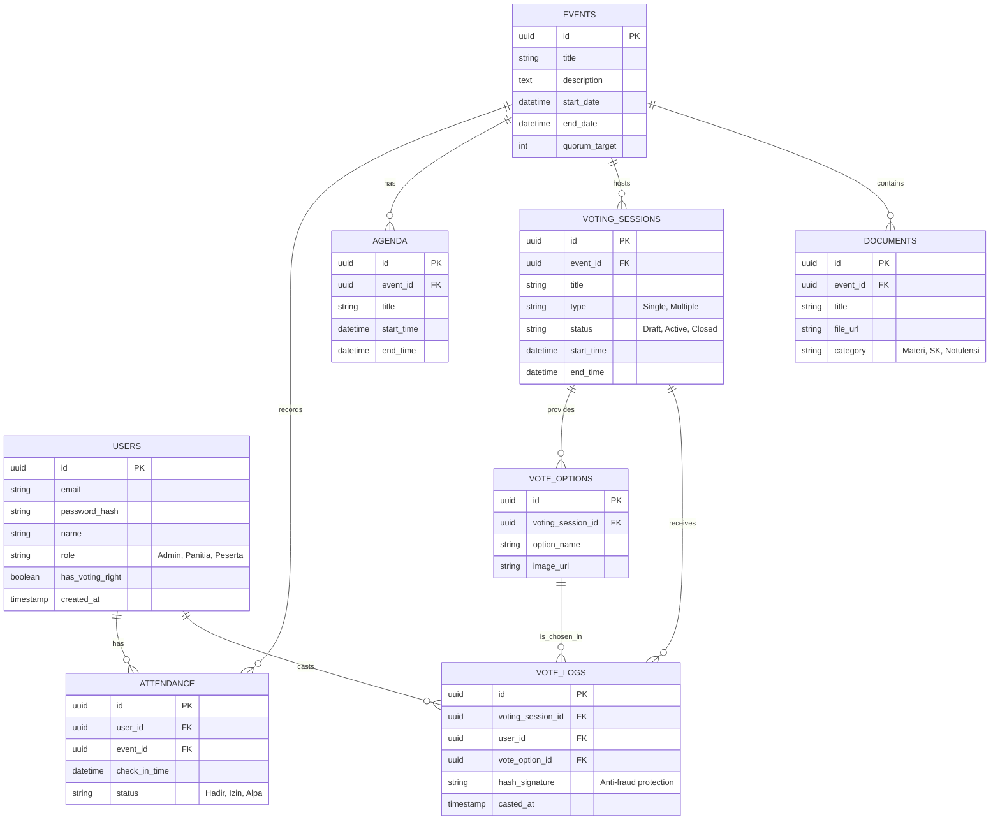

# Entity Relationship Diagram (ERD)

Desain struktur data konseptual MUSKOM.

```mermaid
erDiagram
    USERS {
        uuid id PK
        string email
        string password_hash
        string name
        string role "Admin, Panitia, Peserta"
        boolean has_voting_right
        timestamp created_at
    }

    EVENTS {
        uuid id PK
        string title
        text description
        datetime start_date
        datetime end_date
        int quorum_target
    }

    AGENDA {
        uuid id PK
        uuid event_id FK
        string title
        datetime start_time
        datetime end_time
    }

    ATTENDANCE {
        uuid id PK
        uuid user_id FK
        uuid event_id FK
        datetime check_in_time
        string status "Hadir, Izin, Alpa"
    }

    VOTING_SESSIONS {
        uuid id PK
        uuid event_id FK
        string title
        string type "Single, Multiple"
        string status "Draft, Active, Closed"
        datetime start_time
        datetime end_time
    }

    VOTE_OPTIONS {
        uuid id PK
        uuid voting_session_id FK
        string option_name
        string image_url
    }

    VOTE_LOGS {
        uuid id PK
        uuid voting_session_id FK
        uuid user_id FK
        uuid vote_option_id FK
        string hash_signature "Anti-fraud protection"
        timestamp casted_at
    }

    DOCUMENTS {
        uuid id PK
        uuid event_id FK
        string title
        string file_url
        string category "Materi, SK, Notulensi"
    }

    USERS ||--o{ ATTENDANCE : "has"
    EVENTS ||--o{ ATTENDANCE : "records"
    EVENTS ||--o{ AGENDA : "has"
    EVENTS ||--o{ VOTING_SESSIONS : "hosts"
    EVENTS ||--o{ DOCUMENTS : "contains"
    VOTING_SESSIONS ||--o{ VOTE_OPTIONS : "provides"
    VOTING_SESSIONS ||--o{ VOTE_LOGS : "receives"
    USERS ||--o{ VOTE_LOGS : "casts"
    VOTE_OPTIONS ||--o{ VOTE_LOGS : "is_chosen_in"
```
