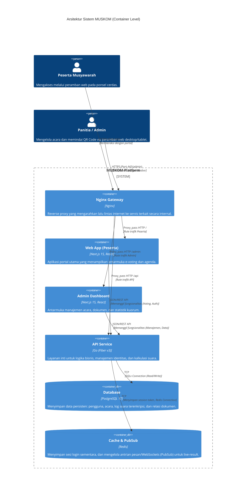

# System Architecture Diagram

Arsitektur aplikasi MUSKOM dirancang dengan memisahkan *backend* dan *frontend* menggunakan arsitektur berbasis *micro-services* skala ringan. Komunikasi antarlayanan (*containers*) ditengahi oleh *Reverse Proxy* dan di-deploy dalam sebuah jaringan terisolasi.

## C4 Container Diagram

Berikut adalah representasi kontainer sistem menggunakan *Mermaid JS*:

