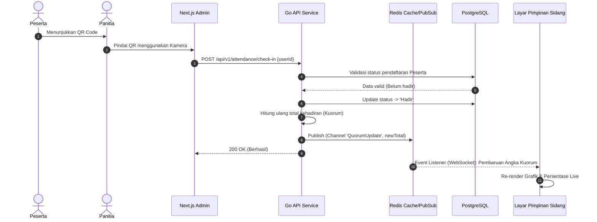
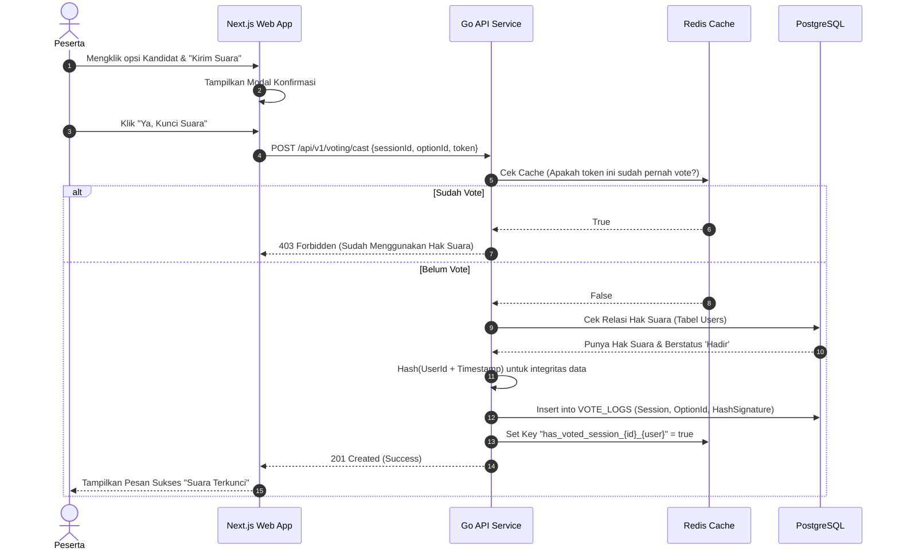

# Sequence Diagrams

Dokumen ini mendeskripsikan secara interaktif dua buah *sequence* utama yang mendasari proses transaksi sistem: Alur *Check-In* Kehadiran dan Alur Pencoblosan Suara (Voting).

## 1. Sequence Diagram: Check-In dan Kuorum

## 2. Sequence Diagram: Proses Pemungutan Suara Terenkripsi

