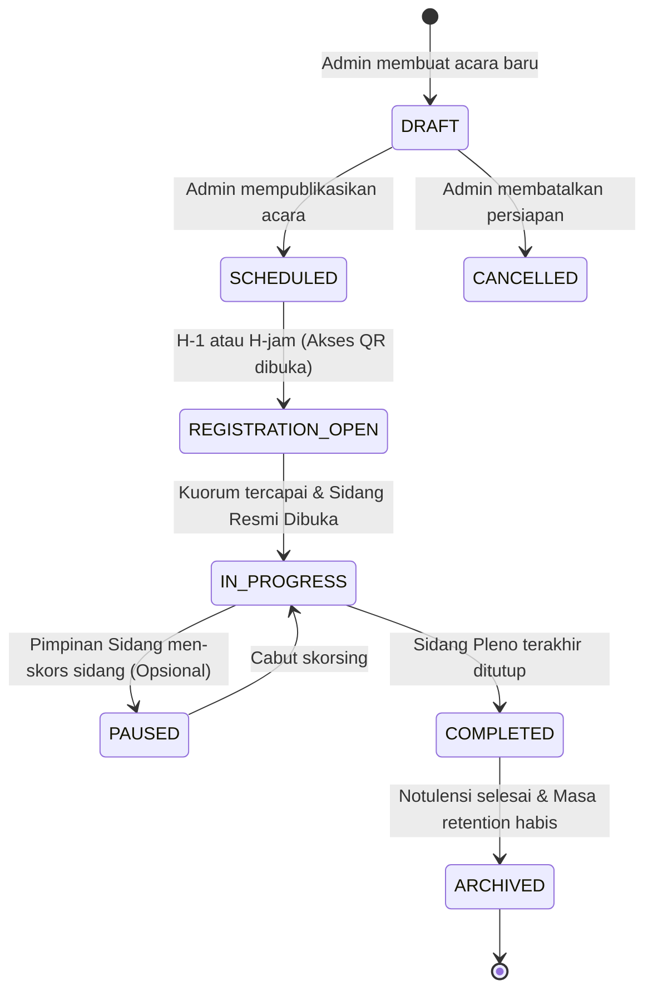
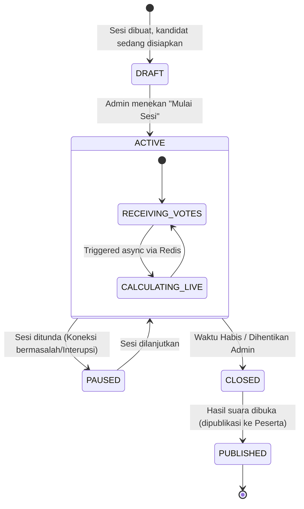

# State Diagram

Sebuah acara (Event) dan sebuah sesi pemilihan (Voting Session) di MUSKOM diatur berdasarkan *State Machine* (Mesin Status) untuk memastikan proses berjalan linear dan data tidak rusak.

## 1. State Diagram: Event (Acara)

Menjelaskan siklus hidup suatu acara musyawarah sejak direncanakan hingga diarsipkan.

## 2. State Diagram: Voting Session

Menjelaskan siklus hidup untuk sebuah kotak suara digital. Sesi pemilihan tidak bisa kembali ke status `ACTIVE` jika sudah berstatus `CLOSED` (untuk mencegah penambahan suara pasca perhitungan final).

