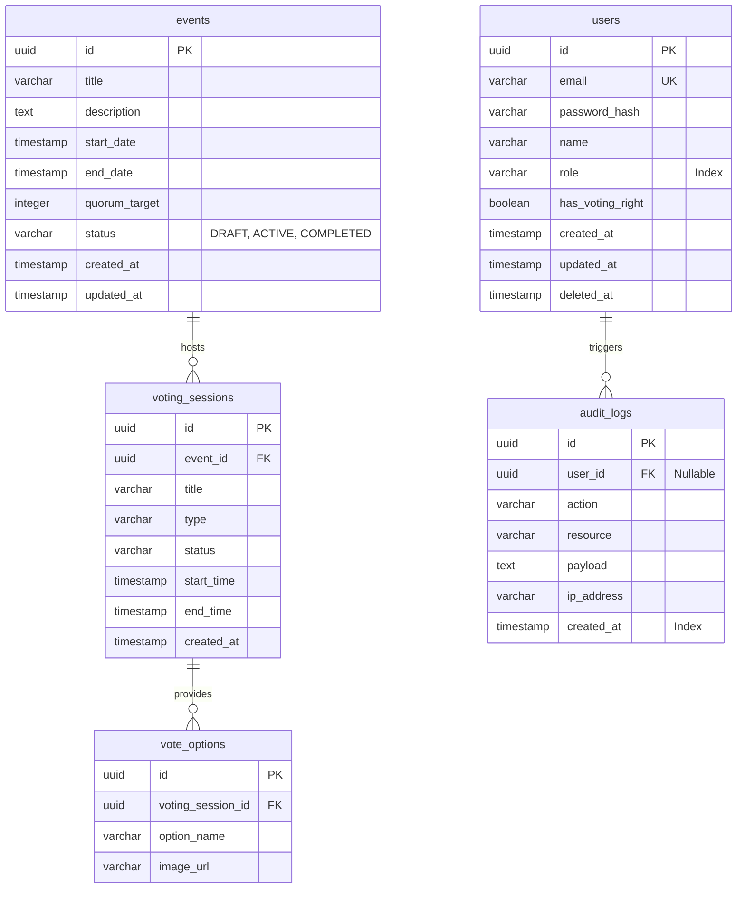

# Backend Database Design & Guidelines

Dokumen ini mendefinisikan standar perancangan basis data, konvensi penamaan, dan strategi migrasi untuk layanan *backend* MUSKOM (PostgreSQL 17).

## 1. Konvensi Penamaan Basis Data (Naming Convention)

Untuk menjaga konsistensi dan kemudahan pembacaan SQL, kita menggunakan aturan berikut:
- **Tabel**: *Snake Case* dan berbentuk jamak (*plural*). Contoh: `users`, `events`, `voting_sessions`.
- **Kolom**: *Snake Case*. Contoh: `first_name`, `quorum_target`.
- **Primary Key**: Harus bernama `id` dengan tipe data `UUID` (dihasilkan secara acak menggunakan *v4* untuk mencegah *ID enumeration*).
- **Foreign Key**: Menggunakan format `[nama_tabel_tunggal]_id`. Contoh: `user_id`, `event_id`.
- **Index**: Menggunakan format `idx_[nama_tabel]_[nama_kolom]`. Contoh: `idx_users_email`.
- **Constraint**: Menggunakan format `fk_[tabel]_[kolom]` untuk foreign key, dan `uq_[tabel]_[kolom]` untuk unik.
- **Timestamp**: Setiap tabel wajib memiliki kolom `created_at` (otomatis) dan `updated_at`. Tabel yang memerlukan *Soft Delete* wajib memiliki `deleted_at`.

## 2. Entity Relationship Diagram (ERD) Lanjutan

Rancangan ERD dengan detail tipe data untuk implementasi fisik.

## 3. Rencana Migrasi (Migration Plan)

Karena kita menggunakan Go, migrasi skema basis data akan dikelola melalui pustaka standar (misal: `golang-migrate/migrate`).

- **Lokasi File**: `/database/migrations`
- **Format Penamaan**: `[unix_timestamp]_[deskripsi].up.sql` dan `[unix_timestamp]_[deskripsi].down.sql`.
- **Aturan Eksekusi**:
  1. Migrasi harus dijalankan sebagai bagian dari proses CI/CD secara otomatis (*Init container* pada Kubernetes atau perintah `docker compose up` untuk lokal).
  2. Eksekusi manual dilarang pada basis data produksi untuk menghindari *schema drift*.
  3. Skrip migrasi harus bersifat *idempotent* atau aman untuk digulirkan ulang (Rollback) menggunakan `.down.sql`.
